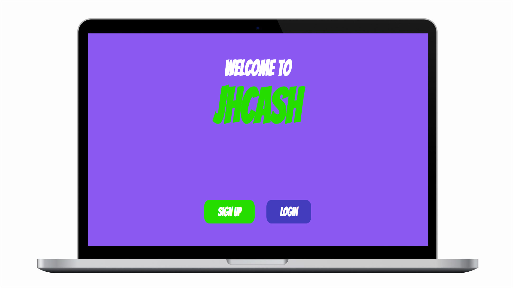
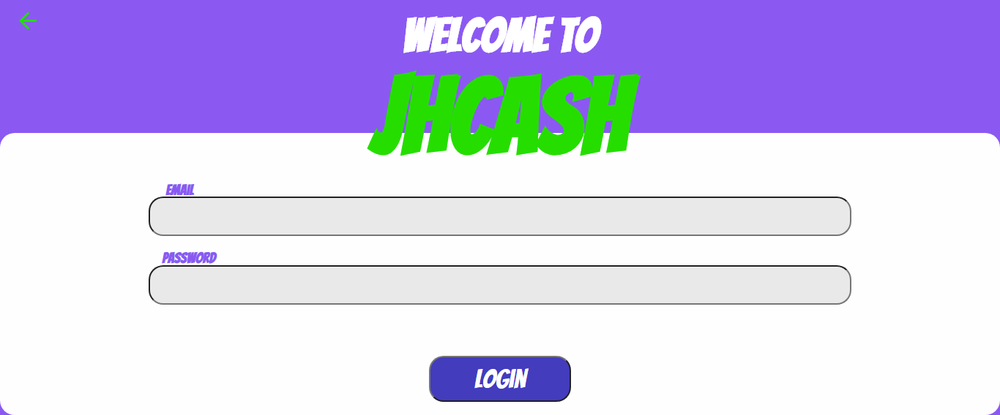
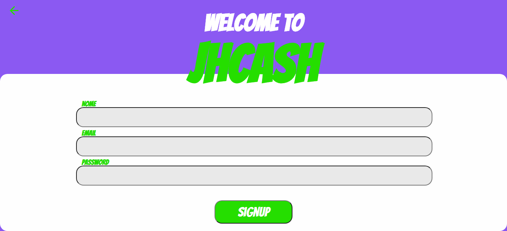

<h1 align="center">
    JHCASH (Web version)
</h1>

    

Here is my project in react, just for *pratice my skills for now is a simple landing, login, and signup pages, whose i try to train some animations. 
i pretend update it soon, with real authenticate in backend, and a mobile version.

## Technology used:

- [Reactjs](https://reactjs.org/)
- [typescript](https://www.typescriptlang.org/)
- [yarn](https://yarnpkg.com/)

## Next Steps

- Real authenticate with backend
- More animations
- Working dashboard
- New features for save money
- Responsive functions

### Login

    

### SignUp

    

